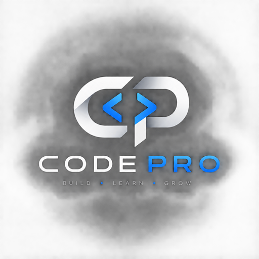

<div align="center">



**A local, invisible overlay that listens to your call, reads your screen, and drafts what to say next.**

[](LICENSE)
[](#installation)
[](https://electronjs.org)
[](#providers)

Bring your own API key. Nothing runs on anyone else's server.

</div>

---

## What it does

Code Pro sits on top of whatever you are doing as a frameless, always-on-top window that is excluded from screen capture. It does three things:

| | |
|---|---|
| 🎧 **Hears** | Transcribes system audio and your microphone as two separate speakers, live |
| 👁 **Sees** | Screenshots the problem on your screen and extracts the statement, constraints and examples |
| 💬 **Answers** | Streams a usable answer — spoken-style reasoning, a traced walkthrough, edge cases and honest complexity |

---

## Features

**Solving**
- Screenshot the problem, press one key, get a complete answer
- Solutions come with a first-person derivation you can say out loud, not a wall of documentation
- A traced walkthrough that runs the code on a real example and explains *why* each load-bearing choice exists — the mutation, the `+1`, the `<` vs `<=`
- Explicit edge cases, and complexity derived from the code actually written rather than recalled
- Won't hide the algorithm behind a one-line library call that dodges the question

**Live conversation**
- Continuous transcription of both sides, labelled *Them* and *You*
- Answer whatever was just said without typing anything
- Ask a private question mid-call and get a streaming reply
- Follow-ups resolve against context — "simpler", "why not a heap", "and the complexity?"

**Staying out of the way**
- Window excluded from screen capture (see [compatibility](#screen-capture-compatibility))
- No native tooltips, dropdowns or cursor changes — those are drawn by the OS and *do* appear in a share
- Click-through mode so the overlay never intercepts a click
- Move, hide, dim and zoom entirely from the keyboard

**Reliability**
- Automatic fallback when a model is out of quota, retired or stalling
- A stalled request is abandoned after 20s and retried on the next model
- Errors say what actually went wrong — spent quota, revoked key, retired model — instead of a generic failure

---

## How it compares

There is a growing category of commercial "interview copilot" tools — **Cluely**, **Final Round AI**, **Interview Coder**, **LockedIn AI**, **Sensei AI** and others. They solve a similar problem and several do it well. The differences that actually matter are structural:

| | Code Pro | Commercial copilots |
|---|---|---|
| **Licence** | AGPL-3.0, source in this repo | Closed source |
| **Cost model** | Free — you pay your AI provider directly for what you use | Subscription |
| **Where your audio goes** | Your machine → your chosen AI provider | Their servers, then a provider |
| **Account required** | None | Sign-up, usually billing too |
| **Provider choice** | Gemini, OpenAI or Anthropic, switchable | Whatever they picked |
| **Auditable** | Read the prompts, change them, rebuild | Trust the description |
| **Works offline-ish** | Only the AI calls leave your machine | Service dependency |
| **If the company folds** | Still yours, still builds | Gone |

**The honest version of that table:** the thing you get here is *control and transparency*, not superiority. Every prompt, every model choice and every piece of capture logic is in this repo and can be changed. Nothing is relayed through a server belonging to anyone else.

### By the numbers

Measured on this machine against the live API, not estimated. One "solve" = screenshot the problem, extract it, generate the full answer with walkthrough, edge cases and complexity.

**Token usage per solve** — `gemini-3.7-flash`, a 1707×960 screenshot:

| Step | Input tokens | Output tokens |
|---|---|---|
| Extraction (screenshot → structured problem) | 1,126 | 313 |
| Solution (code, derivation, walkthrough, edge cases) | 2,216 | 1,711 |
| **Total** | **3,342** | **2,024** |

**What that costs**, at Gemini 3.x Flash introductory pricing ($0.75/1M input, $3.75/1M output):

| Volume | Cost |
|---|---|
| 1 solve | **$0.0101** |
| 30 solves | $0.30 |
| 100 solves | $1.01 |
| 1,000 solves | $10.10 |

**Roughly one cent per problem.** Google's free tier also covers a daily allowance per model, so casual practice is often $0 — and when one model's daily quota runs out, the fallback chain moves to the next rather than stopping.

**What the alternatives charge.** Taken from their own pricing pages, checked September 2026:

| Product | Price | Notes |
|---|---|---|
| **Code Pro** | **~$0.01 per solve** | Your own API key; free tier covers casual use |
| [Cluely](https://cluely.com/pricing) — Starter | Free | Limited AI responses and notetaking |
| [Cluely](https://cluely.com/pricing) — Pro | $19.99 / month | Unlimited responses |
| [Cluely](https://cluely.com/pricing) — Pro + Undetectability | **$149.99 / month** | Hidden from screen-sharing software |
| [Interview Coder](https://www.interviewcoder.co) — Monthly Pro | **$299 / month** | 1,000 usage credits |
| [Interview Coder](https://www.interviewcoder.co) — Lifetime Pro | $799 one-time | Unlimited |

Two of those comparisons are worth spelling out:

- **Invisibility to screen sharing is Cluely's $149.99/month tier.** In Code Pro it is the default behaviour, implemented in [`electron/main.ts`](electron/main.ts) with `setContentProtection`, and costs nothing.
- **Interview Coder's $299/month buys 1,000 credits.** At the measured rate here, **1,000 solves costs about $10.10** in API usage. A credit is not necessarily one solve, so treat that as an order-of-magnitude comparison rather than an exact one.

**How long a subscription's monthly fee lasts here:**

| Their monthly price | Equivalent solves at $0.0101 | Per day, every day |
|---|---|---|
| $19.99 | ~1,980 | 66 |
| $149.99 | ~14,850 | 495 |
| $299.00 | ~29,600 | 987 |

To be fair about it: if you solve five problems a month, a free tier from any of these costs you nothing and takes no setup. The economics only favour running your own key at volume — or when you want the source.

**Response latency**, median time-to-first-token over 3 streaming runs each:

| Model | TTFT | Full response |
|---|---|---|
| `gemini-3.1-flash-lite` | 0.8s | 1.5s |
| `gemini-3.5-flash-lite` | 1.2s | 1.9s |
| `gemini-3.7-flash` | 2.6s | 3.6s |
| `gemini-3.8-flash` | 3.1s | 3.5s |
| `gemini-3.1-pro-preview` | 7.9s | 8.3s |

Live transcription is billed by audio duration rather than per solve, so it scales with how long you listen. That one is **not** measured here — don't take a number for it from this README.

> These figures come from a free-tier key on one machine and one network. Treat them as the right order of magnitude, not a guarantee.

### Where the commercial tools are genuinely better

Worth saying plainly, because a comparison that only flatters itself is useless:

- **Polish.** They have designers, onboarding, and years of iteration on the interaction. This is a fork of an open-source project improved in evenings.
- **Latency.** A funded product runs paid API tiers and tuned infrastructure. On a free-tier key you will sometimes wait several seconds.
- **Support.** There is a company to email. Here there is an issue tracker and whoever feels like answering.
- **Coverage.** Mobile apps, cloud history, team features, résumé and job-description ingestion, curated question banks — none of that exists here.
- **Reliability guarantees.** They test against Zoom, Meet and Teams releases continuously. This is tested against whatever the contributors happen to run.

### Pick this if

You want to know exactly what your machine is doing, run your own key, change the prompts to match how *you* talk, or learn from the code. Pick a commercial tool if you want something that simply works, today, with support behind it.

> Features and pricing of the products named above change often. Check their sites rather than trusting a table in someone else's README — including this one.

---

## Installation

**Prerequisites:** Node.js 16+, npm, and an API key from one of the [providers](#providers).

```bash
git clone https://github.com/DebasishTripathy13/code-pro.git
cd code-pro
npm install
npm run build
npm run package-win     # or: npm run package-mac
```

The installer lands in `release/`. You can also run it without installing:

```bash
& ".\release\win-unpacked\Code Pro.exe"
```

> **The window is invisible on launch by design.** Press <kbd>Ctrl</kbd>+<kbd>B</kbd> to reveal it. If it still doesn't appear, press <kbd>Ctrl</kbd>+<kbd>]</kbd> a few times to raise opacity.

On first run, open Settings and paste your API key.

---

## Keyboard shortcuts

Global shortcuts — they work whether or not the window has focus.

| Action | Shortcut |
|---|---|
| Show / hide the window | <kbd>Ctrl</kbd>+<kbd>B</kbd> |
| Take a screenshot | <kbd>Ctrl</kbd>+<kbd>H</kbd> |
| Solve from screenshots | <kbd>Ctrl</kbd>+<kbd>Enter</kbd> |
| Delete last screenshot | <kbd>Ctrl</kbd>+<kbd>L</kbd> |
| Answer what was just said | <kbd>Ctrl</kbd>+<kbd>Shift</kbd>+<kbd>Enter</kbd> |
| Answer using what's on screen | <kbd>Ctrl</kbd>+<kbd>Shift</kbd>+<kbd>S</kbd> |
| Open the ask box | <kbd>Ctrl</kbd>+<kbd>Shift</kbd>+<kbd>Space</kbd> |
| Stop a streaming answer | <kbd>Ctrl</kbd>+<kbd>Shift</kbd>+<kbd>X</kbd> |
| Toggle click-through | <kbd>Ctrl</kbd>+<kbd>Shift</kbd>+<kbd>C</kbd> |
| Reset — clears everything, recentres the window | <kbd>Ctrl</kbd>+<kbd>R</kbd> |
| Move the window | <kbd>Ctrl</kbd>+<kbd>arrows</kbd> |
| Dim / brighten | <kbd>Ctrl</kbd>+<kbd>[</kbd> / <kbd>Ctrl</kbd>+<kbd>]</kbd> |
| Zoom out / reset / in | <kbd>Ctrl</kbd>+<kbd>-</kbd> / <kbd>Ctrl</kbd>+<kbd>0</kbd> / <kbd>Ctrl</kbd>+<kbd>=</kbd> |
| Quit | <kbd>Ctrl</kbd>+<kbd>Q</kbd> |

On macOS, use <kbd>Cmd</kbd> instead of <kbd>Ctrl</kbd>.

> **If every shortcut seems dead**, a leftover copy of the app is still running and holding them. Close all `Code Pro` processes and relaunch — the app logs the conflict when this happens.

---

## Providers

Choose one in Settings and supply your own key. Requests go directly from your machine to that provider.

| Provider | Solving | Live transcription |
|---|:---:|---|
| **Google Gemini** | ✅ | ✅ streaming, via the Live API |
| **OpenAI** | ✅ | ✅ via Whisper |
| **Anthropic** | ✅ | ❌ no speech-to-text endpoint |

On Anthropic the app works as a screenshot-only tool; the listening features stay off rather than opening a microphone it cannot use.

### Gemini model latency

Median time-to-first-token, three streaming runs each, measured on a free-tier key:

| Model | TTFT | Best for |
|---|---|---|
| `gemini-3.1-flash-lite` | **0.8s** | Live answers mid-conversation |
| `gemini-3.5-flash-lite` | 1.2s | Slightly more capable, still fast |
| `gemini-3.7-flash` | 2.6s | **Recommended** — best all-round for solving |
| `gemini-3.8-flash` | 3.1s | Most capable Flash model |
| `gemini-3.1-pro-preview` | 7.9s | Hard problems, when you can wait |

Free-tier quotas are counted **per model per day**, so one model running out says nothing about the others — which is exactly why the fallback chain exists.

---

## Screen-capture compatibility

The window sets content protection, so it is excluded from:

- ✅ Browser-based screen sharing and recording
- ✅ Discord, all versions
- ✅ Zoom 6.1.6 and below
- ✅ macOS screenshots (<kbd>Cmd</kbd>+<kbd>Shift</kbd>+<kbd>3</kbd>/<kbd>4</kbd>)

It is **not** excluded from:

- ❌ Zoom 6.1.7 and above
- ❌ macOS native screen *recording* (<kbd>Cmd</kbd>+<kbd>Shift</kbd>+<kbd>5</kbd>)

Content protection covers the window only. Anything the OS draws on top — native tooltips, dropdown menus, dialogs, the mouse cursor — is captured normally. Code Pro avoids all of those internally, but it's worth knowing the boundary.

---

## Responsible use

Read this part properly. It matters more than the features list.

**This records both sides of a conversation.** When listening is on, Code Pro transcribes system audio — which means the other person's voice, not just yours. Recording-consent law varies: many places require only one party to consent, and many require everyone. Some workplaces prohibit it regardless of local law. Knowing which applies to you is your responsibility, and the answer is not obvious.

**Transcripts stay on your machine**, held in memory and cleared on reset or exit. Audio is sent to your chosen AI provider for transcription and is subject to that provider's retention policy, not ours. Nothing is written to disk by this app and nothing is sent anywhere else.

**Using this in a real interview is a choice with consequences.** Many companies explicitly forbid assistance tools, and the tool is invisible to screen capture but not to a person watching you. Being caught generally ends the process and can end a relationship with a recruiter or employer permanently.

**What it is genuinely good at** is practice and review — working through problems, seeing an approach explained as reasoning rather than an answer, rehearsing how you'd talk through a solution out loud, and reviewing a recording of your own mock interview afterwards. The walkthroughs were built for exactly this.

If you cannot explain the solution yourself, you have not learned anything — and that is the part an interview is actually measuring.

---

## Configuration

Settings live in a JSON file in your user data directory:

- **Windows** — `%APPDATA%\code-pro\config.json`
- **macOS** — `~/Library/Application Support/code-pro/config.json`

It holds your API key, provider, per-stage model choices, language and window opacity. Settings are migrated automatically from the older `interview-coder-v1` directory on first run.

If a model is retired by the provider, your config is migrated to a working equivalent automatically.

---

## Licence and attribution

Code Pro is licensed under the **GNU AGPL-3.0** — see [LICENSE](LICENSE).

It is a modified version of [CodeInterviewAssist](https://github.com/greeneu/interview-coder-withoupaywall-opensource), which is AGPL-3.0. That licence is inherited, not chosen: any distributed derivative of this code must also be AGPL-3.0, must keep these notices, and must state what was changed.

[CHANGES-FORK.md](CHANGES-FORK.md) is that statement — what was renamed, fixed and added relative to upstream.

Because this is the **Affero** GPL, running a modified version as a network service also counts as distribution: your users must be able to get the source.

---

## Contributing

Issues and pull requests are welcome. See [CONTRIBUTING.md](CONTRIBUTING.md).

Useful context if you're working on this:

- `electron/` is the main process — capture, AI calls, window management, shortcuts
- `src/` is the renderer — React UI
- `electron/ProcessingHelper.ts` holds the solving pipeline and its prompts
- `electron/AssistantHelper.ts` holds the live assistant and transcription
- `npm run dev` runs against a separate config directory from the packaged app, so the two won't share an API key

<div align="center">
<sub>Built as a learning tool. Use it like one.</sub>
</div>
